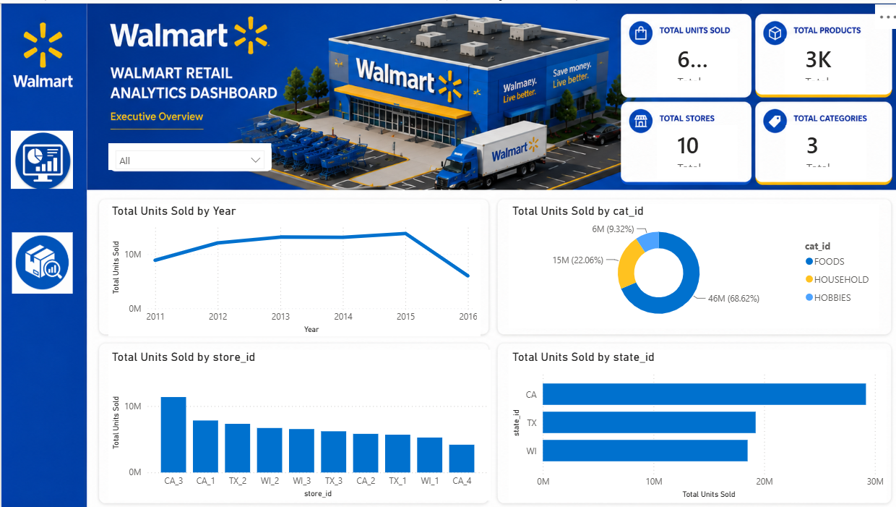
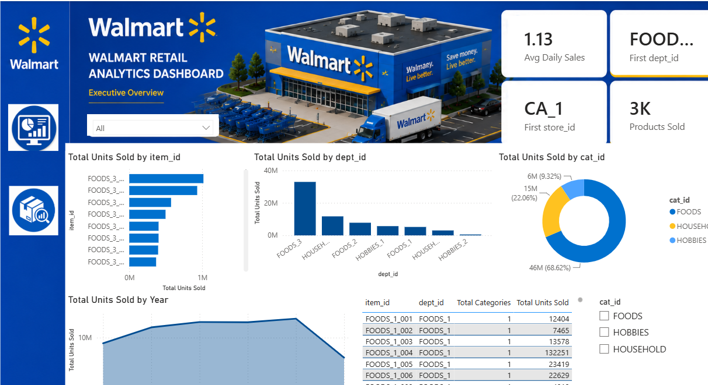

# 🛒 Walmart Sales Analytics Dashboard

## 📊 Dashboard Preview





## 📌 Project Overview

This project presents an interactive Power BI dashboard built to analyze Walmart sales performance and uncover meaningful business insights.

The dashboard focuses on understanding sales trends, product performance, regional performance, and key business metrics to support data-driven decision-making.

---

## 🎯 Business Problem

Retail businesses generate large amounts of sales data, but raw data alone does not provide actionable insights.

This project aims to answer:

* How are sales performing over time?
* Which products contribute the most revenue?
* Which categories and regions perform better?
* What factors impact business growth?

---

## 🛠️ Tools & Technologies Used

* Microsoft Power BI
* Power Query (Data Cleaning & Transformation)
* DAX (Data Analysis Expressions)
* Excel / CSV Dataset
* Data Visualization Techniques

---

## 📊 Dashboard Features

### Key Performance Indicators (KPIs)

* Total Sales
* Total Profit
* Total Orders
* Average Sales
* Growth Analysis

### Analysis Included

✔ Sales trend analysis
✔ Product/category performance
✔ Regional sales comparison
✔ Profit analysis
✔ Customer and order insights

---

## 📈 Key Insights

* Identified top-performing products and categories
* Analyzed sales contribution across regions
* Studied profit trends and business performance
* Found opportunities for improving sales strategy

---

## 🖼️ Dashboard Preview

(Add your dashboard screenshot here)

---

## 📂 Project Files

```
Walmart-Sales-Analytics-Dashboard
│
├── Walmart Dashboard.pbix
├── Dataset.xlsx
├── Screenshots/
└── README.md
```

---

## 🚀 Skills Demonstrated

* Data Cleaning
* Data Modeling
* DAX Measures
* Business Intelligence
* Dashboard Design
* Data Storytelling

---

## 👤 Author

**Yug Panchal**

Aspiring Data Analyst | Power BI | SQL | Python

